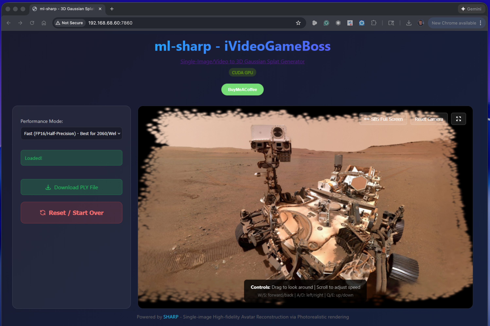
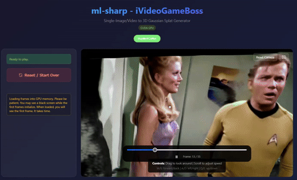
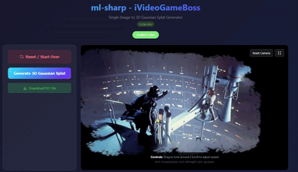
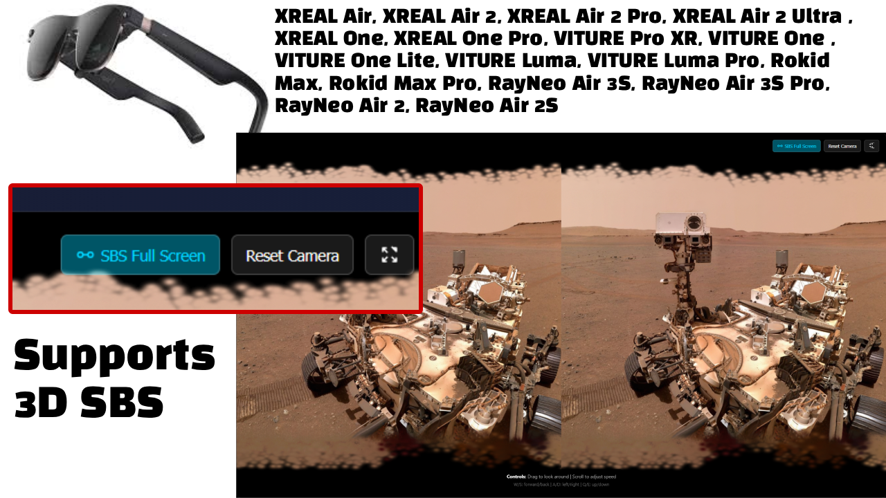
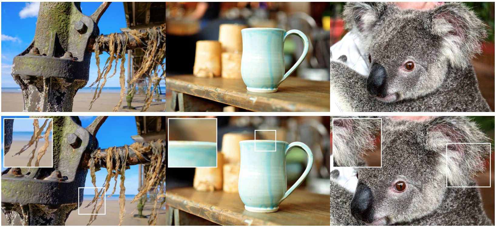

# Gaussian Splatting - Sharp Monocular View Synthesis in Less Than a Second

[](https://apple.github.io/ml-sharp/)
[](https://arxiv.org/abs/2512.10685)

This software project accompanies the research paper: _Sharp Monocular View Synthesis in Less Than a Second_
by _Lars Mescheder, Wei Dong, Shiwei Li, Xuyang Bai, Marcel Santos, Peiyun Hu, Bruno Lecouat, Mingmin Zhen, Amaël Delaunoy,
Tian Fang, Yanghai Tsin, Stephan Richter and Vladlen Koltun_.

## WebUI

This fork includes a browser-based WebUI for generating and viewing 3D Gaussian Splats without using the command line. (https://github.com/Blizaine/ml-sharp)



## Make 3D Movie Clips and fly inside
You can create 3D clips of movies and fly inside! You are only limited by your computer memory.



## Get Inside Your Favorite Movies Scenes with Webcam and OBS Virtual Camera Support
Amazing tech from Apple works with any image. You can even use OBS as a virtual camera and capture a live image and turn it into a 3D splat. Visit the places you always wanted to see in 3D, from movies to historical events.




## Watch Video Demo on iVideoGameBoss YouTube

[](https://youtu.be/aZaGBWggVPc?si=C4t7jL6CJ9JvdgX0)

### click image to watch video [ml-sharp](https://youtu.be/aZaGBWggVPc?si=C4t7jL6CJ9JvdgX0)

## (PC & LINUX ONLY) Full Support for XREAL Air, XREAL Air 2, XREAL Air 2 Pro, XREAL Air 2 Ultra , XREAL One, XREAL One Pro, VITURE Pro XR, VITURE One , VITURE One Lite, VITURE Luma, VITURE Luma Pro, Rokid Max, Rokid Max Pro, RayNeo Air 3S, RayNeo Air 3S Pro, RayNeo Air 2, RayNeo Air 2S, Apple Vision Pro, Occulus

(PC ONLY) Experience 3D like never before with your new AR glasses that support SBS



## (PC & LINUX ONLY) Transform Any 2D Video into a Cinematic 3D SBS Movie

**Unlock the full potential of your AR/VR hardware.** 
Don't just watch your movies—step inside them. With the new **SBS Movie Maker**, `ml-sharp` can ingest any standard 2D video file and reconstruct it into a stunning, depth-accurate Side-by-Side (SBS) 3D experience.

### Watch This Uganda Walking 3D SBS Video Made with ML-Sharp. Use Your XREAL, VITURE , Rokid, RayNeo, Oculus, Meta Quest Glasses

### click image to watch video [ml-sharp Kampala Downtown](https://youtu.be/klRS5Vnkqwo?si=C4t7jL6CJ9JvdgX0)

[](https://youtu.be/klRS5Vnkqwo?si=C4t7jL6CJ9JvdgX0)

Here is the original Kampala Downtown video. You can convert any video to 3D SBS

[The Humble Africa - Kampala Downtown - UGANDA](https://youtu.be/nskIF0_UaUM?si=iEBcHTHhvjGlJK4-)

**Supported Hardware:**
Fully compatible with XREAL (Air/Air 2/Pro/Ultra/One), VITURE (Pro XR/One/Luma), Rokid (Max/Pro), RayNeo (Air 2/3S), Apple Vision Pro, Meta Quest, and any display that supports standard Side-by-Side content.

### How It Works: True Spatial Reconstruction
Unlike basic "2D-to-3D" converters that just shift pixels, `ml-sharp` uses Apple's cutting-edge SHARP architecture to perform a **full 3D reconstruction** of every single frame in your video:

1.  **AI Analysis:** The engine analyzes the footage frame-by-frame to understand geometry and depth.
2.  **Gaussian Splatting:** Each frame is converted into a metric 3D Gaussian Splat scene.
3.  **Stereoscopic Rendering:** Using a virtual dual-camera rig, we render two distinct perspectives (Left Eye and Right Eye) with mathematically correct parallax.
4.  **High-Fidelity Mastering:** The frames are stitched together and the original audio is remastered into the final container.

### Watch This Makkah Walking 3D SBS Video Made with ML-Sharp. Use Your XREAL, VITURE , Rokid, RayNeo, Oculus, Meta Quest Glasses

### click image to watch video [ml-sharp Makkah](https://youtu.be/BLDu1ylXA0E?si=C4t7jL6CJ9JvdgX0)

[](https://youtu.be/BLDu1ylXA0E?si=C4t7jL6CJ9JvdgX0)


Here is the original Makkah video. You can convert any video to 3D SBS

[Immersive Makkah Walking Tour as a Muslim](https://youtu.be/HQzbjtUKjeA?si=p6OCNx6VNlQ9nYHc)

### Crystal Clear Resolution
We refuse to compromise on quality. Your output file is generated at a massive **3840x1080** resolution.
*   **Left Eye:** 1920x1080 (Full HD)
*   **Right Eye:** 1920x1080 (Full HD)

### Why It Always Works
The result is a standard `.mp4` file encoded in the industry-standard Side-by-Side (SBS) format. Because we bake the 3D effect directly into the video file, **it just works**.
*   **No special players required:** Play it in VLC, Windows Media Player, or directly inside your AR Glasses' native media player.
*   **Universal Compatibility:** If your device supports 3D SBS mode, this movie will play perfectly with full depth and immersion.

### Watch This SLUM LIFE Walking 3D SBS Video Made with ML-Sharp. Use Your XREAL, VITURE , Rokid, RayNeo, Oculus, Meta Quest Glasses

### click image to watch video [ml-sharp SLUM LIFE](https://youtu.be/bWuRMWI0Mlg?si=C4t7jL6CJ9JvdgX0)

[](https://youtu.be/bWuRMWI0Mlg?si=C4t7jL6CJ9JvdgX0)

Here is the original SLUM LIFE videos. You can convert any video to 3D SBS

[WALKING EXTREME SLUMS](https://www.youtube.com/@jiggerstv)


## Support
If you find this app useful, consider buying me a coffee!

[](https://buymeacoffee.com/ivideogameboss)

### Features

- **Upload images** directly in your browser
- **Generate 3D Gaussian Splats** with one click
- **Interactive 3D viewer** powered by [Spark.js](https://github.com/sparkjsdev/spark) (THREE.js-based renderer)
- **First-person controls** for exploring your splats:
  - **W/S** - Move forward/backward
  - **A/D** - Strafe left/right
  - **Q/E** - Move up/down
  - **Mouse drag** - Look around
  - **Scroll wheel** - Adjust movement speed
- **Download PLY files** for use in other applications
- **Network accessible** - Use from any device on your local network



We present SHARP, an approach to photorealistic view synthesis from a single image. Given a single photograph, SHARP regresses the parameters of a 3D Gaussian representation of the depicted scene. This is done in less than a second on a standard GPU via a single feedforward pass through a neural network. The 3D Gaussian representation produced by SHARP can then be rendered in real time, yielding high-resolution photorealistic images for nearby views. The representation is metric, with absolute scale, supporting metric camera movements. Experimental results demonstrate that SHARP delivers robust zero-shot generalization across datasets. It sets a new state of the art on multiple datasets, reducing LPIPS by 25–34% and DISTS by 21–43% versus the best prior model, while lowering the synthesis time by three orders of magnitude.

## Test Image - Download Image go inside UGANDA, KAMPALA CITY


[Opolotivation – Uganda Walking Tour YouTube Channel](https://www.youtube.com/@opolotivation)

### Watch This KARABA 3D SBS Video Made with ML-Sharp. Use Your XREAL, VITURE , Rokid, RayNeo, Oculus, Meta Quest Glasses

### click image to watch video [ml-sharp KARABA](https://youtu.be/mdXOHOomcls?si=C4t7jL6CJ9JvdgX0)

[](https://youtu.be/mdXOHOomcls?si=C4t7jL6CJ9JvdgX0)

Here is the original KARABA video. You can convert any video to 3D SBS

[KARABA](https://youtu.be/0JV1Dswpev0?si=eOBOWxN2hQzuZsz2)

## Getting started on MAC or PC or Linux

Installing ml-sharp is very easy and runs on any pc or mac. It can also run without GPU but works faster if you have it. We recommend to first create a python environment. For PC and Linux you must use python 3.10 if you want SBS Video feature. On Mac it works fine with python 3.13 but you don't get SBS video feature. The gsplat library is not supported on MAC to create 3D SBS videos. 

# Installing on PC

# Installation Guide for Windows 11 (Anaconda/Miniconda Method)

This guide is optimized for Windows 11 users with **Visual Studio 2022 (or newer)** and **CUDA 13.x**. It uses **Anaconda (or Miniconda)** to manage the environment and **Pre-built Wheels** to avoid complex compilation errors.

## 1. Prerequisites & Requirements

Before starting, ensure your system meets the hardware requirements and has the necessary software installed.

### Hardware
*   **OS:** Windows 10 or 11
*   **GPU:** NVIDIA GPU with **6GB+ VRAM** (RTX 2060 or newer recommended)
*   **RAM:** 16GB RAM (8GB minimum, though 16GB is recommended for stability)

### Software
1.  **[Anaconda](https://www.anaconda.com/download) or [Miniconda](https://docs.anaconda.com/miniconda/)** (Required)
    *   We use this to create the specific Python 3.10 environment needed for the project.
    *   *Download the Windows 64-bit installer.*

2.  **[Visual Studio 2022 Build Tools](https://visualstudio.microsoft.com/visual-cpp-build-tools/)**
    *   **Crucial Step:** During installation, under the "Workloads" tab, ensure you check **"Desktop development with C++"**.
    *   This provides the `cl.exe` compiler required by the project's graphics libraries.

3.  **[CUDA Toolkit 11.8 or newer](https://developer.nvidia.com/cuda-downloads)**
    *   The engine that allows the code to run on your NVIDIA GPU.
    *   *Note:* Newer versions (CUDA 12.x or 13.x) are fully supported using this guide.

4.  **[Git for Windows](https://git-scm.com/download/win)**
    *   Required to download (clone) the repository.

---

## 2. Environment Setup

1.  Open **Anaconda Prompt** (or Miniconda Prompt) from your Start Menu.
2.  Create a fresh environment using Python 3.10:
    ```cmd
    conda create -n sharp python=3.10 -y
    ```
3.  Activate the environment:
    ```cmd
    conda activate sharp
    ```

---

## 3. Clone Repository

1.  Navigate to the folder where you want to install the project:
    ```cmd
    cd C:\Projects
    ```
    *(Or any folder of your choice)*
2.  Clone the repository:
    ```cmd
    git clone https://github.com/iVideoGameBoss/ml-sharp.git
    cd ml-sharp
    ```

---

## 4. Install Dependencies (The "No-Compile" Method)

Run the following commands **one by one** in your Anaconda Prompt. These steps force the use of pre-compiled files to prevent Visual Studio errors.

1.  **Install Ninja** (Build tool required for extensions):
    ```cmd
    pip install ninja
    ```

2.  **Install PyTorch** (CUDA-enabled version):
    ```cmd
    pip install torch==2.4.0+cu121 torchvision==0.19.0+cu121 torchaudio==2.4.0+cu121 --index-url https://download.pytorch.org/whl/cu121
    ```

3.  **Install GSplat** (Pre-built Wheel):
    *   *Note: We use `--extra-index-url` to ensure dependencies are found correctly.*
    ```cmd
    pip install gsplat==1.5.2 --extra-index-url https://docs.gsplat.studio/whl/pt24cu121
    ```

4.  **Install Remaining Requirements:**
    ```cmd
    pip install "numpy<2"
    pip install -r requirements.txt
    pip install -r requirements-webui.txt
    pip install flask
    ```

5.  **Install Project in Editable Mode:**
    ```cmd
    pip install -e .
    ```

---

## 5. Create the Launcher Script

To ensure the app runs correctly every time (and to handle newer Visual Studio versions automatically), create a dedicated launcher.

1.  Inside the `ml-sharp` folder, create a new file named `run_webui_conda.bat`.
2.  Paste the following code into it and save.
    *   *This script now automatically searches for both Anaconda AND Miniconda.*
    * make sure the path is correct in code below C:\Program Files (x86)\Microsoft Visual Studio\18\BuildTools\VC\Auxiliary\Build\vcvars64.bat
    * make sure the path is correct in code below C:\Program Files (x86)\Microsoft Visual Studio\2022\BuildTools\VC\Auxiliary\Build\vcvars64.bat

```batch
@echo off
setlocal

:: --- CONFIGURATION ---
set "CONDA_ENV_NAME=sharp"

:: --- 1. SETUP VISUAL STUDIO (CL COMMAND) ---
:: Automatically finds Visual Studio 2022 or Preview versions (VS 2026)
if exist "C:\Program Files (x86)\Microsoft Visual Studio\18\BuildTools\VC\Auxiliary\Build\vcvars64.bat" (
    call "C:\Program Files (x86)\Microsoft Visual Studio\18\BuildTools\VC\Auxiliary\Build\vcvars64.bat" >nul
) else (
    if exist "C:\Program Files (x86)\Microsoft Visual Studio\2022\BuildTools\VC\Auxiliary\Build\vcvars64.bat" (
        call "C:\Program Files (x86)\Microsoft Visual Studio\2022\BuildTools\VC\Auxiliary\Build\vcvars64.bat" >nul
    )
)

:: --- CRITICAL FIX FOR NEWER VISUAL STUDIO VERSIONS ---
:: Prevents CUDA from crashing if your VS version is newer than expected
set "NVCC_PREPEND_FLAGS=-allow-unsupported-compiler"

echo ======================================================================
echo                 ML-SHARP WEBUI LAUNCHER (Anaconda)
echo ======================================================================
echo.

:: --- 2. ACTIVATE ANACONDA ENVIRONMENT ---
:: Try standard activation first
call conda activate %CONDA_ENV_NAME% 2>nul
if %ERRORLEVEL% NEQ 0 (
    :: If that fails, try to find the activate script in common locations
    if exist "%UserProfile%\anaconda3\Scripts\activate.bat" (
        call "%UserProfile%\anaconda3\Scripts\activate.bat" %CONDA_ENV_NAME%
    ) else if exist "%UserProfile%\miniconda3\Scripts\activate.bat" (
        call "%UserProfile%\miniconda3\Scripts\activate.bat" %CONDA_ENV_NAME%
    ) else (
        echo [ERROR] Could not activate Conda environment '%CONDA_ENV_NAME%'.
        echo Please open Anaconda Prompt manually.
        pause
        exit /b 1
    )
)

:: --- 3. CHECK DEPENDENCIES (Auto-Fix) ---
python -c "import torch; import gsplat; print(f'Torch: {torch.__version__} | GSplat loaded')" >nul 2>&1
if %ERRORLEVEL% NEQ 0 (
    echo [WARNING] Dependencies appear missing. Attempting auto-fix...
    pip install ninja
    pip install torch==2.4.0+cu121 torchvision==0.19.0+cu121 torchaudio==2.4.0+cu121 --index-url https://download.pytorch.org/whl/cu121
    pip install gsplat==1.5.2 --extra-index-url https://docs.gsplat.studio/whl/pt24cu121 --force-reinstall
    pip install "numpy<2"
    pip install flask
    pip install -e .
)

:: --- 4. LAUNCH WEBUI ---
echo.
echo Starting server in Conda env: %CONDA_ENV_NAME%
echo Access the UI at: http://127.0.0.1:7860
echo.

python webui.py --preload

if %ERRORLEVEL% NEQ 0 (
    echo.
    echo [ERROR] Server crashed. Review the error log above.
    pause
)
```

6. Run the Application
Double-click run_webui_conda.bat to start the application.
You should see something like this.
```

2025-12-30 18:40:27,013 | INFO | Preloading model...
2025-12-30 18:40:27,016 | INFO | CUDA GPU detected: NVIDIA GeForce RTX 2060 SUPER
2025-12-30 18:40:27,016 | INFO | Targeting device for inference: cuda
2025-12-30 18:40:27,016 | INFO | Downloading model from https://ml-site.cdn-apple.com/models/sharp/sharp_2572gikvuh.pt
2025-12-30 18:40:29,743 | INFO | Initializing predictor...
2025-12-30 18:40:29,743 | INFO | Using preset ViT dinov2l16_384.
2025-12-30 18:40:33,203 | INFO | Using preset ViT dinov2l16_384.
2025-12-30 18:40:37,180 | INFO | Moving model to cuda...
2025-12-30 18:40:37,787 | INFO | Model successfully loaded and running on: cuda
2025-12-30 18:40:37,788 | INFO | Starting WebUI at http://0.0.0.0:7860
 * Serving Flask app 'webui'
 * Debug mode: off
```

Open your browser and go to http://127.0.0.1:7860.

# Installing on MAC

Install Homebrew

```
/bin/bash -c "$(curl -fsSL https://raw.githubusercontent.com/Homebrew/install/HEAD/install.sh)"
```

After install, follow the printed instructions to add Homebrew to your shell PATH (for zsh on macOS):

```
echo 'eval "$(/opt/homebrew/bin/brew shellenv)"' >> ~/.zshrc

eval "$(/opt/homebrew/bin/brew shellenv)"

```

To confirm:
```
brew --version
```

We’ll use Miniconda for environment isolation:
```
brew install --cask miniconda
```

Initialize Conda for your shell (zsh):
```
conda init zsh
exec $SHELL

```

Check Conda works:
```
conda --version
```

ml-sharp expects Python 3.10–3.13 (the repo uses ~3.10–3.13). Use a clean environment:
```
conda create -n mlsharp python=3.13 -y
conda activate mlsharp
```

You should now see (mlsharp) in your prompt.

Clone the ml-sharp source:

```
git clone https://github.com/iVideoGameBoss/ml-sharp.git
cd ml-sharp
```

Install Python dependencies using the requirements.txt file:
```
pip install --upgrade pip
pip install -r requirements.txt
pip install -r requirements-webui.txt
```

Verify installation:
```
sharp --help
```

Make the script executable
```
chmod +x run_webui.sh
```

Start the WebUI
```
./run_webui.sh
```

Wait until you see to open your browser to:
```
Http://localhost:7860
```

# Installation Guide: ml-sharp on Zorin OS 18 (Ubuntu 24.04)

This guide covers the installation of `ml-sharp` on a fresh install of Zorin OS 18 using an NVIDIA RTX 2060 Super (8GB). It addresses specific requirements for Python 3.10, CUDA 12, and Conda Terms of Service. You should first create a system restore point using timeshift app so you can revert back if you encounter issues. 

### Phase 1: Update & Install NVIDIA Drivers

Update System:Open Terminal (Ctrl+Alt+T) and run:
```
sudo apt update && sudo apt upgrade -y
sudo apt install git build-essential -y
```


###  Install NVIDIA Drivers:

Open Zorin Menu → System Tools → Software & Updates.

Click the Additional Drivers tab.

Select "Using NVIDIA driver metapackage from nvidia-driver-550 (proprietary)" (or the latest version available).

Click Apply Changes.

Reboot your computer immediately.


### Phase 2: Install CUDA Toolkit

This installs the system-level CUDA tools so your terminal recognizes GPU commands.

Install the Toolkit:
```
sudo apt install nvidia-cuda-toolkit -y
```

Verify Installation: You should see output starting with nvcc: NVIDIA (R) Cuda compiler driver...
```
nvcc --version
```


### Phase 3: Install Miniconda & Accept Licenses
We use Miniconda to get Python 3.10 without messing up Zorin's default Python 3.12.

Download and Install:
```
mkdir -p ~/miniconda3
wget https://repo.anaconda.com/miniconda/Miniconda3-latest-Linux-x86_64.sh -O ~/miniconda3/miniconda.sh
bash ~/miniconda3/miniconda.sh -b -u -p ~/miniconda3
rm -rf ~/miniconda3/miniconda.sh
```

Initialize Conda:
```
~/miniconda3/bin/conda init bash
```

Accept Terms of Service (Crucial Step):
Run these commands to prevent the "ToS" error you saw earlier:
```
~/miniconda3/bin/conda tos accept --override-channels --channel https://repo.anaconda.com/pkgs/main
~/miniconda3/bin/conda tos accept --override-channels --channel https://repo.anaconda.com/pkgs/r
```
Restart Terminal:
Close your terminal window and open a new one.


### Phase 4: Create Environment & Install GPU Libraries
We install the specific GPU versions before the repo requirements to avoid conflicts.

Create and Activate Python 3.10 Environment:
```
conda create -n mlsharp python=3.10 -y
conda activate mlsharp
```

Install PyTorch (CUDA 12.1 Version):
```
pip install torch==2.4.0+cu121 torchvision==0.19.0+cu121 torchaudio==2.4.0+cu121 --index-url https://download.pytorch.org/whl/cu121
```

Install Gsplat (Rendering Engine):
You might see some red errors for a specific version on this command. Keep pushing forward.
```
pip install gsplat --index-url https://docs.gsplat.studio/whl/pt24cu121
```


Pin NumPy (Prevent Version 2.0 Crash):
```
pip install "numpy<2"
```


### Phase 5: Install ml-sharp Repo
```
cd ~
git clone https://github.com/iVideoGameBoss/ml-sharp.git
cd ml-sharp
```

Install Dependencies:
When you run requirements.txt you might see some red error text. Just push forward
```
pip install --upgrade pip
pip install -r requirements.txt
pip install -r requirements-webui.txt
pip install flask
```

Install Repo in Editable Mode:
```
pip install -e .
```


### Phase 6: Run the WebUI
Make Script Executable (First time only)
```
chmod +x run_webui.sh
```
How to Run in the Future
```
conda activate mlsharp
cd ~/ml-sharp
./run_webui.sh
```


Open in Browser
Go to: http://127.0.0.1:7860

Start the WebUI

## Using the CLI

To run prediction:

```
sharp predict -i /path/to/input/images -o /path/to/output/gaussians
```

The model checkpoint will be downloaded automatically on first run and cached locally at `~/.cache/torch/hub/checkpoints/`.

Alternatively, you can download the model directly:

```
wget https://ml-site.cdn-apple.com/models/sharp/sharp_2572gikvuh.pt
```

To use a manually downloaded checkpoint, specify it with the `-c` flag:

```
sharp predict -i /path/to/input/images -o /path/to/output/gaussians -c sharp_2572gikvuh.pt
```

The results will be 3D gaussian splats (3DGS) in the output folder. The 3DGS `.ply` files are compatible to various public 3DGS renderers. We follow the OpenCV coordinate convention (x right, y down, z forward). The 3DGS scene center is roughly at (0, 0, +z). When dealing with 3rdparty renderers, please scale and rotate to re-center the scene accordingly.


### Running the WebUI on PC or Mac

1. Install the additional WebUI dependency on PC:
   ```
   pip install -r requirements-webui.txt
   ```

2. Start the WebUI server:

   **Windows:**
   ```
   run_webui.bat
   ```

   **Linux/Mac:**
   ```
   ./run_webui.sh
   ```

3. Open your browser to `http://localhost:7860`

The WebUI will be accessible from other devices on your network at `http://<your-ip>:7860`.

### Rendering trajectories (CUDA GPU only)

Additionally you can render videos with a camera trajectory. While the gaussians prediction works for all CPU, CUDA, and MPS, rendering videos via the `--render` option currently requires a CUDA GPU. The gsplat renderer takes a while to initialize at the first launch.

```
sharp predict -i /path/to/input/images -o /path/to/output/gaussians --render

# Or from the intermediate gaussians:
sharp render -i /path/to/output/gaussians -o /path/to/output/renderings
```

## Evaluation

Please refer to the paper for both quantitative and qualitative evaluations.
Additionally, please check out this [qualitative examples page](https://apple.github.io/ml-sharp/) containing several video comparisons against related work.

## Citation

If you find our work useful, please cite the following paper:

```bibtex
@inproceedings{Sharp2025:arxiv,
  title      = {Sharp Monocular View Synthesis in Less Than a Second},
  author     = {Lars Mescheder and Wei Dong and Shiwei Li and Xuyang Bai and Marcel Santos and Peiyun Hu and Bruno Lecouat and Mingmin Zhen and Ama\"{e}l Delaunoy and Tian Fang and Yanghai Tsin and Stephan R. Richter and Vladlen Koltun},
  journal    = {arXiv preprint arXiv:2512.10685},
  year       = {2025},
  url        = {https://arxiv.org/abs/2512.10685},
}
```

## Acknowledgements

Our codebase is built using multiple opensource contributions, please see [ACKNOWLEDGEMENTS](ACKNOWLEDGEMENTS) for more details.

## License

Please check out the repository [LICENSE](LICENSE) before using the provided code and
[LICENSE_MODEL](LICENSE_MODEL) for the released models.

# Star History

[](https://star-history.com/#iVideoGameBoss/ml-sharp&Date)
